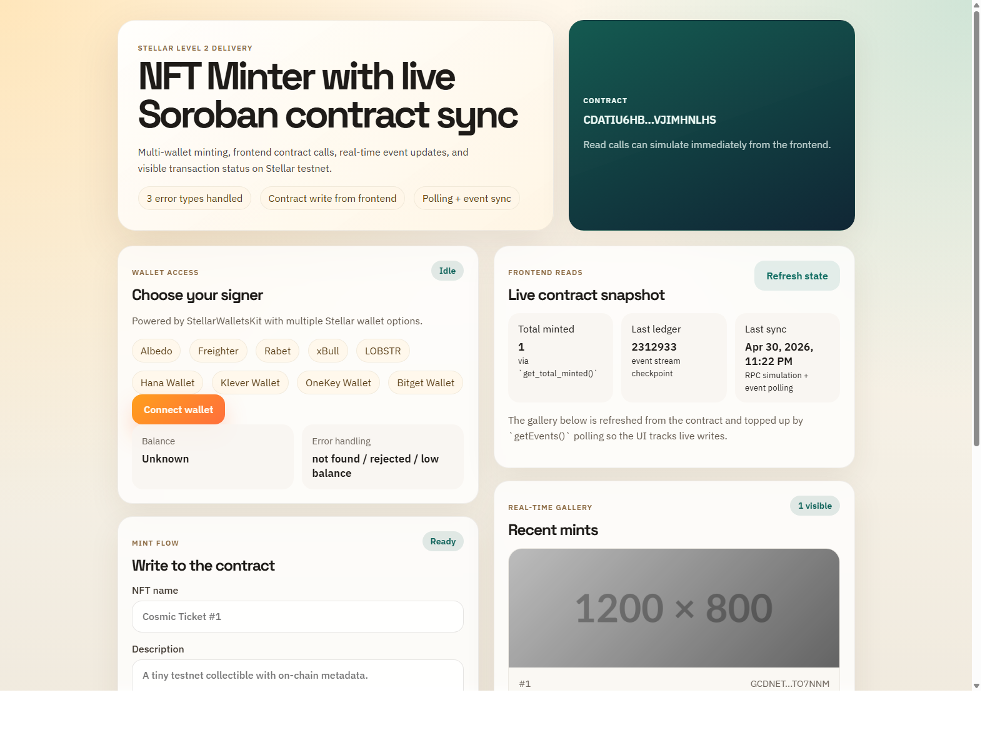

# NFT-Mint

NFT Minter for Stellar Level 2: a multi-wallet testnet dapp that mints simple NFT metadata through a Soroban contract, shows transaction status, and keeps the UI synchronized with live contract events.

## What it includes

- StellarWalletsKit multi-wallet integration
- Three handled error cases:
  - wallet not found
  - user rejected wallet request
  - insufficient testnet balance
- Soroban smart contract deployed to Stellar testnet
- Frontend contract reads and writes
- Pending / success / failure transaction state
- Real-time event polling with gallery synchronization

## Screenshot

Wallet options available in the frontend:



## Testnet deployment

- Contract address:
  `CDATIU6HBFB4JRQY2ELI62UPOT33C6O4VHHCJSOUT5TKGR7VJIMHNLHS`
- Contract explorer:
  `https://stellar.expert/explorer/testnet/contract/CDATIU6HBFB4JRQY2ELI62UPOT33C6O4VHHCJSOUT5TKGR7VJIMHNLHS`
- Verification contract-call transaction hash:
  `397c7e13e02423f8eeb5d27fcc31ff1a2be40ceeb4d3964e4092f7fe3684b9e1`
- Verification transaction explorer:
  `https://stellar.expert/explorer/testnet/tx/397c7e13e02423f8eeb5d27fcc31ff1a2be40ceeb4d3964e4092f7fe3684b9e1`

Additional deployment artifacts:

- Wasm upload tx:
  `4faacfecf29bdfef944e4084c11148b949047f8a2979de25d685bbd1f83a52db`
- Contract deploy tx:
  `8787d1dc54d8941afa848f5931429fa0b2a3b23b29920376fa834442028f80e2`

## Stack

- React + TypeScript + Vite
- `@stellar/stellar-sdk`
- `@creit-tech/stellar-wallets-kit`
- Soroban smart contract in Rust

## Local setup

### Prerequisites

- Node.js 24+
- Rust + Cargo
- Rust target: `wasm32v1-none`

### Install

```bash
npm install
```

### Run the frontend

```bash
npm run dev
```

The app already points to the deployed testnet contract by default through:

- `VITE_CONTRACT_ID`
- `VITE_SIMULATION_ACCOUNT`

You can override them in a local `.env` file if you want to use a different deployment.

### Build the frontend

```bash
npm run build
```

### Test the contract

```bash
npm run contract:test
```

### Build the contract Wasm

```bash
npm run contract:build
```

### Deploy a new contract

```bash
npm run deploy:contract
```

The deploy script:

- uploads the compiled Wasm
- deploys a new testnet contract
- performs a verification `mint` call
- writes deployment output to `deployment/testnet.json`

## Frontend behavior

- Wallet access is handled with StellarWalletsKit and a built-in wallet chooser.
- Contract reads use Soroban RPC simulation for `get_total_minted` and `get_recent_tokens`.
- Contract writes call `mint` from the frontend and display pending / success / fail state.
- Event synchronization uses `getEvents()` polling to refresh the gallery after new mints land on-chain.
- Low-balance guidance points users to fund testnet wallets before minting.

## Project scripts

```bash
npm run dev
npm run build
npm run preview
npm run contract:test
npm run contract:build
npm run deploy:contract
```

## Live demo

Not deployed yet. A Vercel or Netlify deployment can be added on top of this repo.
